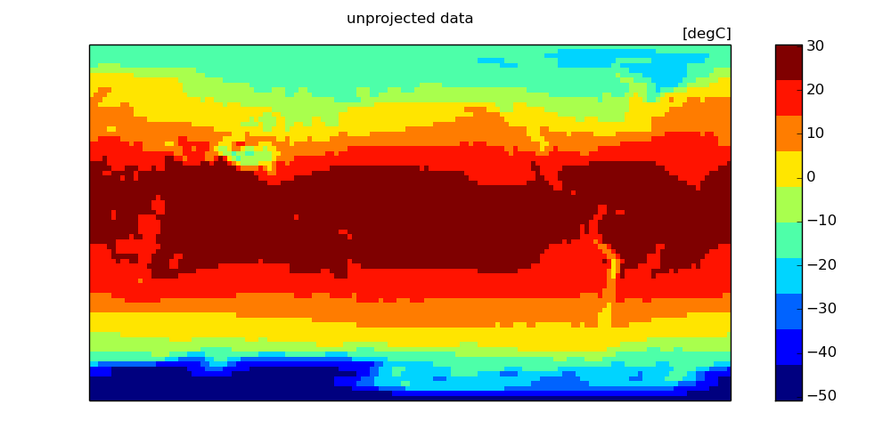
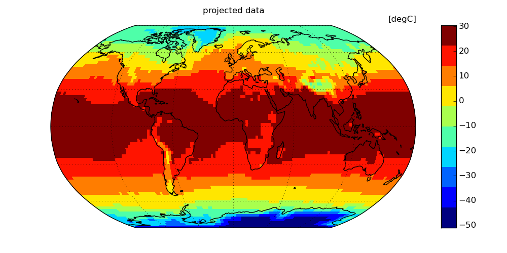
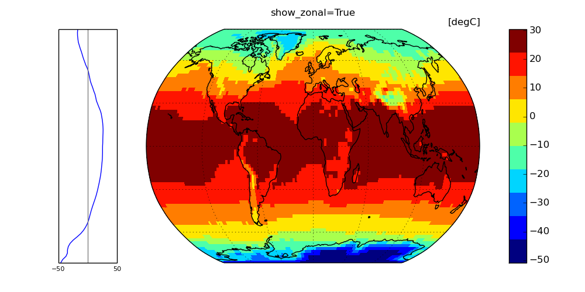
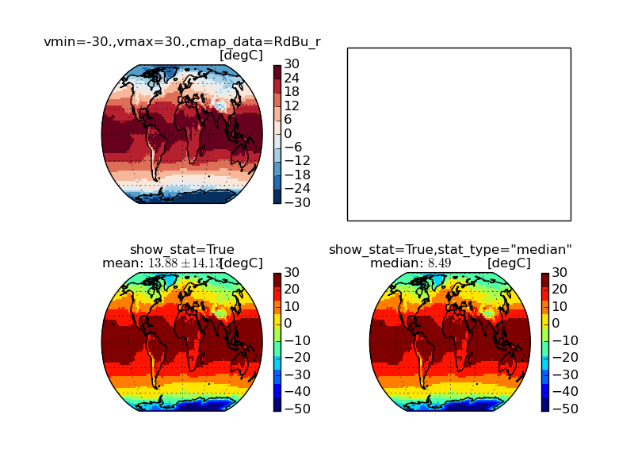

pyCMBS gallery
==============

In the following, examples will be given that introduce different features of pyCMBS.

Basic plotting
--------------

Read some sample data and just plot it::

    from pycmbs.mapping import map_plot
    import matplotlib.pyplot as plt
    from pycmbs.examples import download
    import numpy as np

    # Read some sample data ...
    air = download.get_sample_file(name='air')
    air.label = 'air temperature'

    # a quick plot as well as a projection plot
    f1 = map_plot(air)  # unprojected
    f2 = map_plot(air, use_basemap=True)  # projected
    plt.show()

For plotting you have a rich suite of keyword parameters. Please use the
python help() system to get full documentation from docstrings. Some
more illustrations of options are provided::

    map_plot(air,show_zonal=True, use_basemap=True,title='show_zonal=True')

And a few more details on customizing your map ...::

    map_plot(air, use_basemap=True, title='vmin=-30.,vmax=30.,cmap_data=RdBu_r', vmin=-30., vmax=30., cmap_data='RdBu_r', ax=ax1)
    map_plot(air, show_stat=True, use_basemap=True,title='show_stat=True',ax=ax3)
    map_plot(air, show_stat=True, stat_type='median', use_basemap=True, title='show_stat=True,stat_type="median"', ax=ax4)

